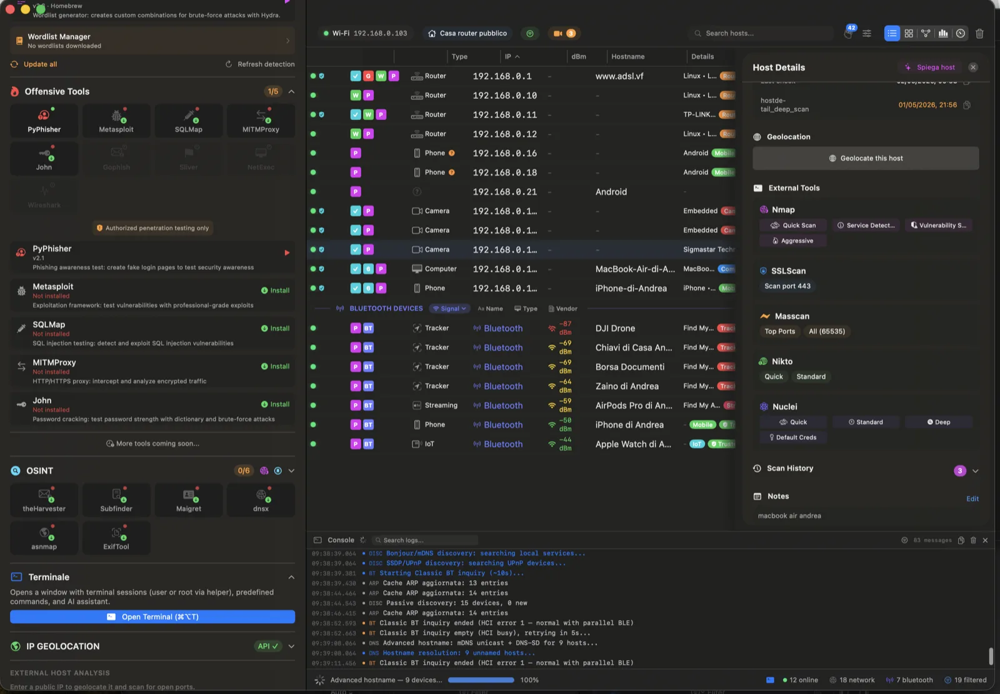
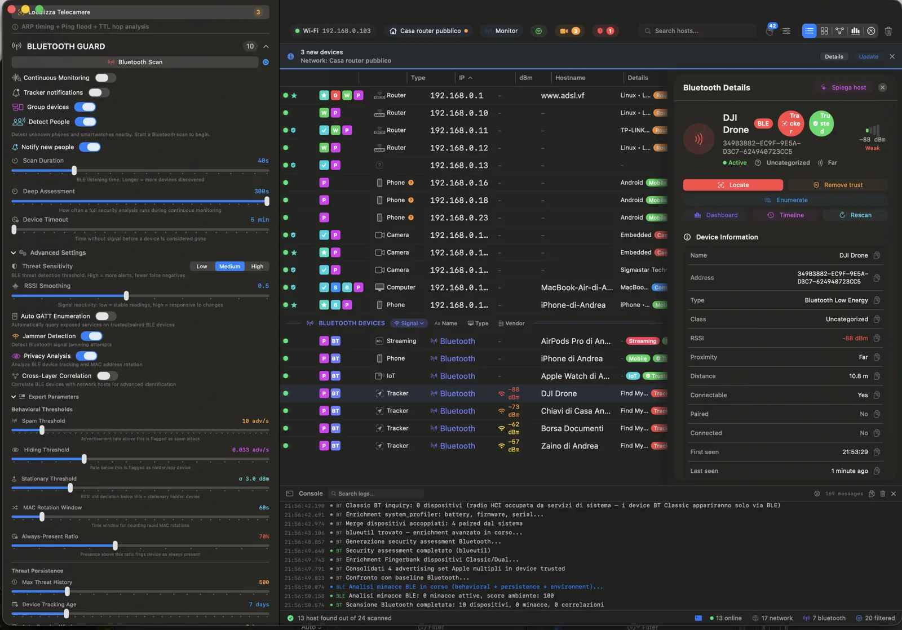
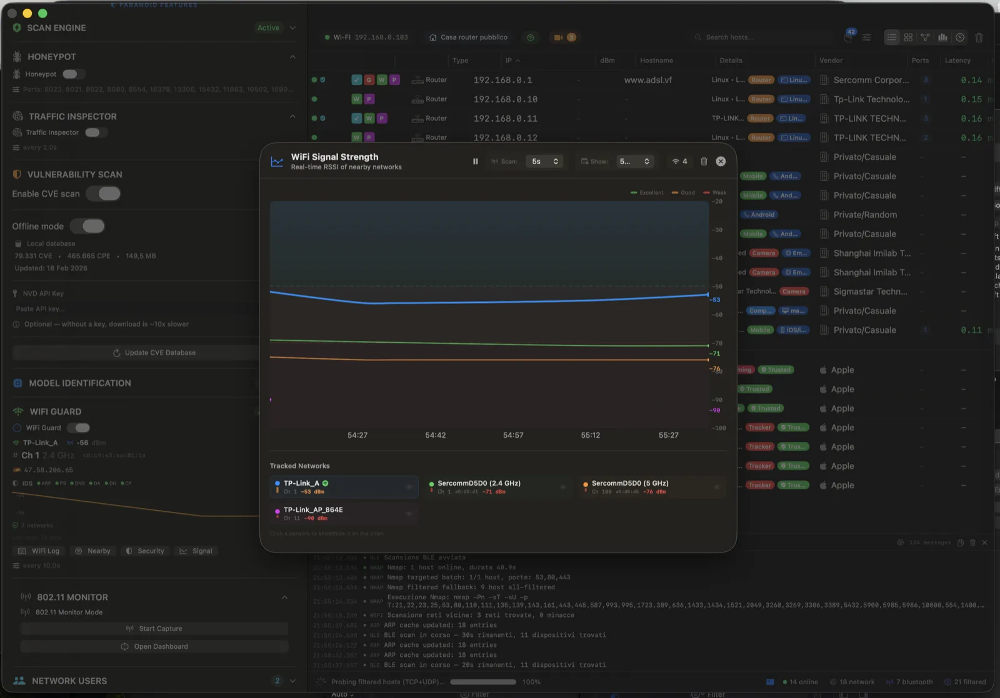

# 🛡️ Paranoid Privileged Helper for macOS

> **The open-source root daemon that powers [Paranoid](https://getparanoid.app) — auditable, signed, sandboxed.**

[](https://www.apple.com/macos/)
[](https://swift.org)
[](LICENSE)
[]()
[]()
[]()
[]()

---

## ⬇️ Get the App

The full GUI lives at **👉 [getparanoid.app](https://getparanoid.app)** — this repo is the privileged daemon only. Run the helper standalone, embed it in your own pentest tooling, or audit every byte before letting it touch your kernel. Your call.

> 🆓 **Free TestFlight build for contributors** — ship a meaningful PR and email **andreapiani.dev@gmail.com** for a no-strings-attached macOS TestFlight invite.

---

## 🧠 Why This Repo Exists

Paranoid asks for your admin password once. After that, a **LaunchDaemon running as `root`** sits in the background and answers XPC calls from the GUI. That daemon is *exactly* the thing a security-conscious user should never trust on faith.

So we open-sourced it.

🔍 **Audit it.** Read the 26 operation classes. Diff every release. Compile from source if you want.
🧪 **Reproduce builds.** No vendored binaries — pure Swift + a tiny C bridge for libpcap/raw sockets.
🪛 **Fork it.** MIT-licensed. Strip what you don't need. Bolt your own ops on top.

The closed-source GUI is the product. The thing with `root` is *yours to verify*.

---

## � Screenshots

Real captures from the full Paranoid app — these features are powered by the helper daemon in this repo:

| Offensive Tools | Bluetooth Guard | Wi-Fi Signal & Monitor |
|:--:|:--:|:--:|
|  |  |  |
| **Integrated pentesting suite** — PyPhisher, Metasploit, SQLMap, MITMProxy, John, OSINT tools and a built-in terminal. All one click away. | **BLE / Classic device discovery** — identify AirTags and Find My trackers, follow RSSI in real time, locate stalking devices. | **Wi-Fi analysis** — scan nearby networks, inspect channels and RSSI, detect evil twins, rogue APs, deauth attacks. |

---

## �🚀 What This Helper Actually Does

A privileged macOS daemon exposing **26 raw-network primitives** over XPC. Think of it as `nmap` + `tcpdump` + `airodump-ng` glued together with `NSXPCConnection`, except:

- ✅ **Single privilege escalation** (`SMAppService.daemon` → install once, no `sudo` ever again)
- ✅ **Code-signed both directions** — helper verifies the caller, app verifies the helper
- ✅ **Whitelist-enforced command execution** — no `os.system("rm -rf $USER_INPUT")` shenanigans
- ✅ **Per-call XPC connection** with guaranteed continuation resume (no stuck Swift `await`)
- ✅ **Native `os.log` structured logging** — every operation correlated by session UUID

If you've ever shipped an app that asks for `sudo` on every scan, you'll appreciate why this matters.

---

## 🛠️ The Toolbox — All 26 Operations

### 📡 Network Discovery (Layer 2)

| Op | What | Why You Care |
|----|------|--------------|
| 🔎 **`scanARP`** | libpcap ARP sweep across CIDR/range | Finds every device on the LAN. Faster than `nmap -sn`, sees devices with no open ports |
| 🎯 **`scanARPTiming`** | High-precision Layer-2 RTT (`mach_absolute_time`) | Camera-locator mode — physical proximity via L2 latency |
| 🛰️ **`discoverNDP`** | IPv6 neighbor discovery (ICMPv6 multicast → NDP table) | The IPv6 cousin of ARP — you didn't think IPv4 was the whole story, did you? |
| 👻 **`passiveDiscovery`** | BPF promiscuous capture of mDNS / SSDP / NetBIOS / DHCP | Fingerprint devices that refuse to answer probes |
| 🔌 **`discoverLLDP`** | LLDP/CDP frame capture | Reveals managed-switch port, VLAN, mgmt IP — gold for internal audits |

### 🔫 Active Probing (raw sockets / pcap)

| Op | What | Notes |
|----|------|-------|
| ⚡ **`scanSYN`** | Raw TCP SYN scan via L2 pcap_inject | macOS kernel intercepts SOCK_RAW SYN-ACKs — this op uses **full L2 Ethernet injection** to bypass it |
| 🌐 **`scanUDP`** | UDP scan with DNS/SNMP/NTP probes + ICMP unreachable capture | Real UDP scanning, not the broken `connect()` fake |
| 🔁 **`pingICMP`** | Raw ICMP echo with TTL + latency | The classic, done right |
| 🛣️ **`tracerouteICMP`** | TTL-incrementing ICMP traceroute | Faster + more accurate than `Process` wrapping `traceroute(8)` |
| 🛡️ **`pcapScanPorts` / `pcapPing`** | L2 SYN-scan + ping that **bypasses pf firewall + VPN kill-switch** | Your kill-switch can't block what's injected below the IP stack |
| 🔍 **`captureSYNACK`** | Raw SYN-ACK fingerprint (window size, MSS, options, TTL) | Passive OS fingerprinting fuel |

### 🚨 Defense / IDS

| Op | What | Detects |
|----|------|---------|
| 🚷 **`monitorIncomingSYN`** | BPF capture of inbound SYN packets | Port-scanners hammering your laptop |
| 🕵️ **`detectARPSpoof`** | pcap ARP-reply monitor with gateway MAC anchor | Classic MITM — gateway MAC flip, IP→MAC many-to-one |
| 📞 **`detectRogueDHCP`** | DHCP DISCOVER broadcast + OFFER capture | Unauthorized DHCP servers (corp-network nightmare) |

### 📶 802.11 / WPA

| Op | What | Output |
|----|------|--------|
| 📻 **`startMonitorMode`** / **`stopMonitorMode`** | `pcap_set_rfmon` 802.11 raw capture w/ channel hopping | RadioTap + 802.11 parsed: beacon, probe req/resp, deauth, EAPOL |
| 🤝 **`captureHandshake`** | Targeted WPA 4-way handshake capture (M1→M2→M3→M4 state machine) | `.pcap` + `.hc22000` (Hashcat mode 22000) ready files |
| ⚠️ **`sendDeauthAttack`** | 802.11 deauth via pcap injection | ⚠️ Apple chipsets often silently drop these — use a USB adapter |

### 💥 Auxiliary

| Op | What | Use Case |
|----|------|----------|
| 📨 **`sendWakeOnLAN`** | Magic packet as raw L2 frame | Wake sleeping NAS, no IP needed |
| 🌍 **`bulkDNSResolve`** | Bulk reverse-DNS w/ in-memory TTL cache | Hostname enrichment for a /24 in one XPC roundtrip |
| 📜 **`inspectHTTP`** | Plain-HTTP DPI on port 80 | Catch SQLi/XSS patterns leaving your network |
| 💻 **`executeCommand`** | Whitelist-validated `Process` exec as root | Runs `nmap`, `masscan`, `bettercap` from Homebrew without password prompts |
| 🖥️ **`openPTYSession`** + write/resize/close | Real PTY via `forkpty()` as root | Full interactive root shell streamed to the GUI |

### 🔥 Honeypot / Firewall (pf packet filter)

| Op | What | Use Case |
|----|------|----------|
| 🚫 **`applyPFBlocks`** | Writes `block drop in/out quick from <ip>` rules to anchor `com.apple/250.ParanoidBlocks` | Auto-ban attacker IPs detected by the honeypot, no `sudo pfctl` user prompt |
| 🪤 **`applyHoneypotRedirects`** | Writes `rdr` rules to anchor `com.apple/250.ParanoidRedirect` (e.g. 22→8022, 80→8080, 3389→13389) | Make honeypots listen on standard privileged ports without binding as root |
| 🧹 **`clearHoneypotPF`** | Selectively flushes block + redirect anchors | Stop honeypot → restore network state, no `/etc/pf.conf` mutation ever |

Anchors live under `com.apple/` namespace so they're auto-loaded by the default macOS `pf.conf` (both `anchor "com.apple/*"` and `rdr-anchor "com.apple/*"` are present out of the box). **No system file is modified.** Validation: IPs via `inet_pton` (IPv4 + IPv6), ports `1-65535`, iface alphanumeric, proto `tcp|udp`.

---

## 🔐 Security Model — The "Why You Can Trust This"

```
┌────────────────────┐  XPC (signed both sides)   ┌──────────────────────┐
│  Paranoid.app      │ ◀───────────────────────▶  │  HelperDaemon (root) │
│  (closed source)   │   andreapiani.IPscanner    │  (this repo)         │
│  user permissions  │   .helper Mach service     │  LaunchDaemon        │
└────────────────────┘                            └──────────────────────┘
```

🔒 **Mutual code-sign verification.** Each XPC connection enforces:
```
anchor apple generic and identifier "andreapiani.IPscanner"
and certificate leaf[subject.OU] = "ERAK83QBBM"
```
Tamper with the app bundle → helper rejects the call. Swap the helper → app rejects the connection.

🔒 **Per-call proxy + guaranteed `continuation.resume`.** Old XPC code leaks `await`s when the connection drops mid-call. We use a `safeXPCCall` wrapper with `NSLock + resumed flag` — never hangs, never silently falls back to `osascript` password dialogs.

🔒 **Whitelisted `executeCommand`.** Symlink-resolved before whitelist check (Homebrew Cellar paths included for arm64 + x86_64). No shell metacharacter escape vector — args are an `[String]` array, not a string.

🔒 **No network endpoints.** Helper only listens on the local Mach service. No TCP/UDP server, no auto-update phoning home.

🔒 **Reproducible.** Build with `xcodebuild`, ship with `SMAppService.daemon`. No precompiled blobs in the repo.

---

## 🧬 Architecture (one-screen tour)

```
IPscanner.helper/
├── main.swift                       # NSXPCListener bootstrap
├── HelperDaemonDelegate.swift       # Mutual code-sign verification
├── HelperDaemonOperations.swift     # XPC method dispatch (26 ops)
├── Info.plist                       # LaunchDaemon plist (SMAppService)
├── Bridging/
│   ├── pcap_bridge.[ch]             # libpcap C wrappers
│   ├── raw_socket.[ch]              # SOCK_RAW + L2 injection
│   └── HelperDaemon-Bridging-Header.h
├── Operations/                      # 26 isolated operation classes
│   ├── BaseOperation.swift          # Cancellation + progress streaming
│   ├── ARPScanOperation.swift
│   ├── PcapSYNScanOperation.swift   # The L2-bypass SYN scanner
│   ├── HandshakeCaptureOperation.swift
│   ├── MonitorModeOperation.swift
│   └── ... (19 more)
└── Shared/                          # Code shared with the GUI app
    ├── PrivilegedHelperProtocol.swift   # The XPC contract
    ├── HelperConstants.swift            # Bundle IDs, version, signing reqs
    └── HelperProgressProtocol.swift     # Streaming progress callbacks
```

Read [`Shared/PrivilegedHelperProtocol.swift`](Sources/Shared/PrivilegedHelperProtocol.swift) first — it's the entire public surface in 400 lines.

---

## 🏗️ Build It Yourself

**Requires:** Xcode 15+, macOS 14+, Apple Developer ID for code signing.

```bash
git clone https://github.com/andreapianidev/paranoid-macOS-security-helper.git
cd paranoid-macOS-security-helper

# Open in Xcode (you'll need to set up your own signing identity)
open Sources/

# Or compile via xcodebuild
xcodebuild -target IPscanner.helper -configuration Release
```

⚠️ Standalone deployment requires an Apple Developer Team ID + valid code-signing identity. The helper's signing requirement is currently pinned to `ERAK83QBBM` — fork and update [`HelperConstants.swift`](Sources/Shared/HelperConstants.swift) to use your own.

---

## 🤝 We're Hiring (Contributors)

We want this helper to outlive our company. If you do any of the following, **please open an issue or PR**:

- 🐛 **Bug hunters** — found a logic flaw, race condition, or privilege escalation? [Open a security advisory](https://github.com/andreapianidev/paranoid-macOS-security-helper/security/advisories/new) or email **andreapiani.dev@gmail.com** with `[SECURITY]` in the subject
- 🧪 **Reverse engineers / pentesters** — audit the XPC surface, fuzz the operation handlers, break things
- 🦅 **Swift concurrency wizards** — there are still a few `@unchecked Sendable` workarounds we'd love to remove
- 🐧 **C/networking nerds** — better libpcap filters, IPv6 parity for every IPv4 op, eBPF-style packet matching
- 📡 **WiFi hackers** — improve the WPA handshake state machine, add WPA3 SAE capture, support USB chipsets
- 📝 **Doc writers** — every operation deserves a sequence diagram

**📬 Contributors get a free macOS TestFlight build of the full Paranoid app — email `andreapiani.dev@gmail.com` after your first merged PR.** No questions asked, no expiry games.

### 💡 Good First Issues

- Add unit tests for `PacketBuilder.swift` (no test target exists yet — feel free to introduce one)
- Document the `safeXPCCall` pattern in `Operations/BaseOperation.swift` with a sequence diagram
- Port `detectARPSpoof` to also catch gratuitous ARP floods (currently only flips)
- Add a `--standalone-cli` flag to `main.swift` so the helper can be invoked outside the macOS app context

---

## 📡 Talking to the Helper from Your Own App

The XPC contract is plain `@objc protocol PrivilegedHelperProtocol`. Wire it from any Swift app:

```swift
let connection = NSXPCConnection(
    machServiceName: "andreapiani.IPscanner.helper",
    options: .privileged
)
connection.remoteObjectInterface = NSXPCInterface(with: PrivilegedHelperProtocol.self)
connection.resume()

let proxy = connection.remoteObjectProxy as! PrivilegedHelperProtocol
proxy.scanARP(
    interfaceName: "en0",
    startIP: "192.168.1.1",
    endIP: "192.168.1.254",
    timeoutMs: 2000,
    operationId: UUID().uuidString
) { data, error in
    // JSON-decoded array of {ip, mac}
}
```

⚠️ Your app's code-signing requirement must match the helper's expectation, or the connection is rejected. Update [`HelperConstants.appSigningRequirement`](Sources/Shared/HelperConstants.swift) accordingly.

---

## 🔭 Roadmap

- [ ] Swift 6 strict concurrency cleanup
- [ ] WPA3 SAE handshake capture
- [ ] eBPF-equivalent in-kernel filtering (NetworkExtension `NEFilterPacketProvider`)
- [ ] Unit + integration test suite (currently zero tests — yes, we know)
- [ ] Standalone CLI mode (no GUI required)
- [ ] Linux port (different XPC layer, same C bridge)

---

## 📋 SEO Soup For The Search Crawlers

> macOS privileged helper · macOS security helper daemon · SMAppService LaunchDaemon Swift · NSXPCConnection mutual code signing · macOS root permissions XPC · raw socket macOS Swift · libpcap macOS helper · macOS network scanner open source · WPA handshake capture macOS · WiFi monitor mode macOS · macOS pentest helper · Homebrew automation macOS · privilege escalation audit macOS · macOS port scanner Swift · ARP scan libpcap Swift · open source macOS security tool

---

## 📜 License

MIT — see [LICENSE](LICENSE). Use it. Audit it. Fork it. Ship it. Just don't blame us when you point it at the wrong network. 🫡

## 🌐 Links

- 🏠 **Main app:** https://getparanoid.app
- 📧 **Contact / TestFlight invites:** andreapiani.dev@gmail.com
- 🐛 **Security advisories:** [GitHub Security Advisories](https://github.com/andreapianidev/paranoid-macOS-security-helper/security/advisories/new)
- 💬 **Issues / PRs:** [GitHub Issues](https://github.com/andreapianidev/paranoid-macOS-security-helper/issues)

---

<sub>Built by paranoid people for paranoid people. If you're not paranoid, you're not paying attention. 🦝</sub>
